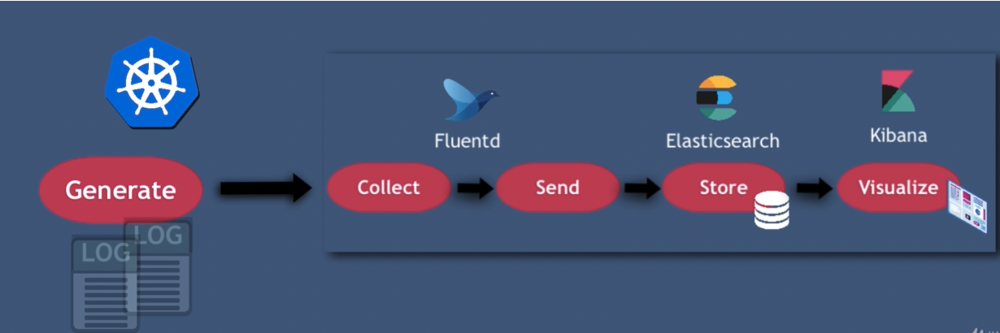

https://gitlab.com/nanuchi/efk-course-commands


#### Install kubectl

[installation guide Kubectl](https://v1-16.docs.kubernetes.io/docs/tasks/tools/install-kubectl/)


#### Install helm 3

[installation guide Helm](https://helm.sh/docs/intro/install/)


#### Helm Chart repository links:

- [Ingress Nginx Controller Chart](https://github.com/kubernetes/ingress-nginx/tree/master/charts/ingress-nginx)
- [Fluentd Chart](https://github.com/bitnami/charts/tree/master/bitnami/fluentd)
- [Elastic Search Chart](https://github.com/elastic/helm-charts/blob/master/elasticsearch)
- [Kibana Chart](https://github.com/elastic/helm-charts/blob/master/kibana)


#### Install Java and set JAVA_HOME to execute ./gradlew command

[Installation Guide Java - Linux and Windows](https://docs.oracle.com/cd/E19182-01/820-7851/inst_cli_jdk_javahome_t/)

#### Configure Java home path for gradle through IDE or directly on the command line with command

    ./gradlew -Dorg.gradle.java.home=/jdk_path_directory


#### Fluentd Regex UI 
https://fluentular.herokuapp.com/


## Set up elastic stack in kubernetes cluster

###### Deploy and access Dasboard
    kubectl apply -f https://raw.githubusercontent.com/kubernetes/dashboard/v2.0.0/aio/deploy/recommended.yaml
    kubectl proxy 
    http://localhost:8001/api/v1/namespaces/kubernetes-dashboard/services/https:kubernetes-dashboard:/proxy/.

###### For alternatives/ways to access K8s dashboard externally, see
    https://www.edureka.co/community/31282/is-accessing-kubernetes-dashboard-remotely-possible

###### create docker-registry secret for dockerHub
    DOCKER_REGISTRY_SERVER=docker.io
    DOCKER_USER=your dockerID, same as for `docker login`
    DOCKER_EMAIL=your dockerhub email, same as for `docker login`
    DOCKER_PASSWORD=your dockerhub pwd, same as for `docker login`

    kubectl create secret docker-registry myregistrysecret \
    --docker-server=$DOCKER_REGISTRY_SERVER \
    --docker-username=$DOCKER_USER \
    --docker-password=$DOCKER_PASSWORD \
    --docker-email=$DOCKER_EMAIL


### Set cluster-config.yaml file for kubectl after you downloading config file from Linode

###### Restrict kubeconfig file permissions - to avoid security warning in helm v.3.3.2 upwards
https://github.com/microsoft/azure-pipelines-tasks/pull/13633#issue-495303841

    chmod 600 /path/to/config.yaml

###### Linux, MacOS
    export KUBECONFIG=/path/to/config.yaml

###### Windows
    create folder C:\Users\username\.kube
    rename cluster-config.yaml to config
    put config file in .kube folder


### Install Elastic Stack (EFK) Elastic, FluentD, Kibana

##### install elastic search chart 
    helm repo add elastic https://Helm.elastic.co
    helm install elasticsearch elastic/elasticsearch -f values-linode.yaml

##### install Kibana chart
    helm install kibana elastic/kibana

##### access Kibana locally
    kubectl port-forward deployment/kibana-kibana 5601
    access: localhost:5601

##### install nginx-ingress controller
    helm repo add stable https://charts.helm.sh/stable 
    helm repo add ingress-nginx https://kubernetes.github.io/ingress-nginx
    helm install nginx-ingress ingress-nginx/ingress-nginx

###### NOTE
Repo has been deprecated - https://stackoverflow.com/a/57970816    
    
    helm repo add stable https://kubernetes-charts.storage.googleapis.com/ 

##### install Fluentd
    helm repo add bitnami https://charts.bitnami.com/bitnami
    helm install fluentd bitnami/fluentd


### Other useful commands

##### restart Fluentd deamonSet
    kubectl rollout restart daemonset/fluentd

##### restart elastic search statefulSet
    kubectl rollout restart statefulset/elasticsearch-master

##### install specific helm version
    helm install elasticsearch elastic/elasticsearch --version="7.9.0" -f values-linode.yaml
    helm install kibana elastic/kibana --version="7.9.0"
    helm install fluentd bitnami/fluentd --version="2.0.1"

    helm install nginx-ingress ingress-nginx/ingress-nginx --version="2.15.0"

##### install helm chart in a specific namespace (namespace must already exist)
    helm install elasticsearch elastic/elasticsearch -f values-linode.yaml -n elastic


# EFK

`Fluentd -> ElasticSearch -> Kbana`




## K8s Dashboard

install dashboard https://github.com/kubernetes/dashboard

create sample user to get token

https://github.com/kubernetes/dashboard/blob/master/docs/user/access-control/creating-sample-user.md

```
// https://github.com/kubernetes/dashboard/blob/master/aio/deploy/recommended.yaml
// https://github.com/amliuyong/Docker_K8s/blob/main/multi-k8s/k8s-dashboard.yaml

kubectl apply -f https://raw.githubusercontent.com/kubernetes/dashboard/v2.1.0/aio/deploy/recommended.yaml
kubectl proxy
 ```
http://localhost:8001/api/v1/namespaces/kubernetes-dashboard/services/https:kubernetes-dashboard:/proxy/.
 
### create a user and get token
```
cat <<EOF | kubectl apply -f -
apiVersion: v1
kind: ServiceAccount
metadata:
  name: admin-user
  namespace: kubernetes-dashboard
EOF


cat <<EOF | kubectl apply -f -
apiVersion: rbac.authorization.k8s.io/v1
kind: ClusterRoleBinding
metadata:
  name: admin-user
roleRef:
  apiGroup: rbac.authorization.k8s.io
  kind: ClusterRole
  name: cluster-admin
subjects:
- kind: ServiceAccount
  name: admin-user
  namespace: kubernetes-dashboard
EOF
```
```
access dashboard
kubectl proxy
```
http://localhost:8001/api/v1/namespaces/kubernetes-dashboard/services/https:kubernetes-dashboard:/proxy/.

token for user admin-user
```
kubectl -n kubernetes-dashboard describe secret $(kubectl -n kubernetes-dashboard get secret | grep admin-user | awk '{print $1}')
```

## Pre install Config
https://github.com/elastic/helm-charts


### PV

```yaml
kind: PersistentVolume
apiVersion: v1
metadata:
  name: es-data-holder
  labels:
    type: local
spec:
  storageClassName: hostpath
  capacity:
    storage: 5Gi
  accessModes:
    - ReadWriteOnce
  hostPath:
    path: /Users/dayong-mac/data

```
### config 
- values-linode.yaml

```yaml

# Shrink default JVM heap.
esJavaOpts: "-Xmx128m -Xms128m"
replicas: 1
minimumMasterNodes: 1
antiAffinity: "soft"

# Allocate smaller chunks of memory per pod.
resources:
  requests:
    cpu: "100m"
    memory: "512M"
  limits:
    cpu: "1000m"
    memory: "512M"

# Request smaller persistent volumes.
volumeClaimTemplate:
  accessModes: ["ReadWriteOnce"]
  # storageClassName: "linode-block-storage"
  storageClassName: hostpath
  resources:
    requests:
      storage: 100M

```
## Install
### Install elasticsearch and kibana
```
helm install elasticsearch elastic/elasticsearch -f values-linode.yaml
helm install kibana elastic/kibana

kubectl port-forward deployment/kibana-kibana 5601

```
 http://127.0.0.1:5601/app/home#/

### install ingress-nginx/ingress-nginx
 ```
helm repo add stable https://charts.helm.sh/stable 
helm repo add ingress-nginx https://kubernetes.github.io/ingress-nginx

helm install nginx-ingress ingress-nginx/ingress-nginx

 ```

###  kibana-ingress
- kibana-ingress.yaml
  
```yaml
apiVersion: extensions/v1beta1
kind: Ingress

metadata:
  name: kibana-ingress
  annotations:
    kubernetes.io/ingress.class: nginx
    # nginx.ingress.kubernetes.io/use-regex: "true"

spec:
  rules:
    - host: kibana.dev
      http:
        paths:
          - path: /
            backend:
              serviceName: kibana-kibana
              servicePort: 5601

```

https://kibana.dev/
`thisisunsafe`


### install Fluentd
```
helm repo add bitnami https://charts.bitnami.com/bitnami
helm install fluentd bitnami/fluentd

```
#### Fluentd config map - fluentd-forwarder-cm

```yaml
kind: ConfigMap
apiVersion: v1
metadata:
  name: fluentd-forwarder-cm
  namespace: default
  labels:
    app.kubernetes.io/component: forwarder
    app.kubernetes.io/instance: fluentd
    app.kubernetes.io/managed-by: Helm
    app.kubernetes.io/name: fluentd
    helm.sh/chart: fluentd-1.3.0
  annotations:
    meta.helm.sh/release-name: fluentd
    meta.helm.sh/release-namespace: default
data:
  fluentd.conf: |

    # Ignore fluentd own events
    <match fluent.**>
        @type null
    </match>

    # HTTP input for the liveness and readiness probes
    <source>
        @type http
        port 9880
    </source>

    # Throw the healthcheck to the standard output instead of forwarding it
    <match fluentd.healthcheck>
        @type null
    </match>

    # Get the logs from the containers running in the node
    <source>
      @type tail
      path /var/log/containers/*-app*.log
      pos_file /opt/bitnami/fluentd/logs/buffers/fluentd-docker.pos
      tag kubernetes.*
      read_from_head true
      format json
      time_format %Y-%m-%dT%H:%M:%S.%NZ
    </source>

    <filter **>
      @type parser
      key_name log
      <parse>
        @type multi_format
        <pattern>
          format json
          time_key time
          keep_time_key true
        </pattern>
      </parse>
    </filter>

    # enrich with kubernetes metadata
    <filter kubernetes.**>
        @type kubernetes_metadata
    </filter>


    <match kubernetes.var.log.containers.**java-app**.log>
      @type elasticsearch
      include_tag_key true
      host "elasticsearch-master.default.svc.cluster.local"
      port "9200"
      index_name "java-app-logs"
      <buffer>
        @type file
        path /opt/bitnami/fluentd/logs/buffers/java-logs.buffer
        flush_thread_count 2
        flush_interval 5s
      </buffer>
    </match>

    <match kubernetes.var.log.containers.**node-app**.log>
      @type elasticsearch
      include_tag_key true
      host "elasticsearch-master.default.svc.cluster.local"
      port "9200"
      index_name "node-app-logs"
      <buffer>
        @type file
        path /opt/bitnami/fluentd/logs/buffers/node-logs.buffer
        flush_thread_count 2
        flush_interval 5s
      </buffer>
    </match>

```

## Search logs in ElasticSearch

https://kibana.dev/app/dev_tools#/console

 ```
 GET /node-app-logs/_search
{
  "query": {"match_all": {}}
}


GET /java-app-logs/_search
{
  "query": {"match_all": {}}
}

 ```